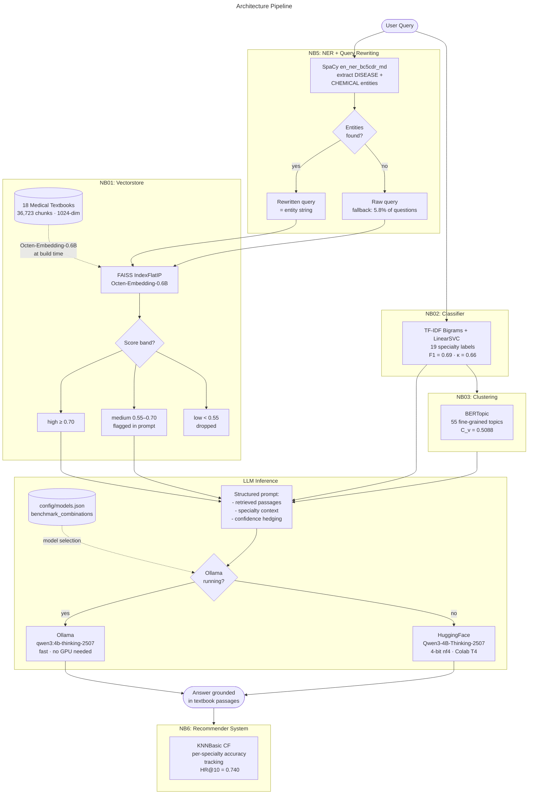
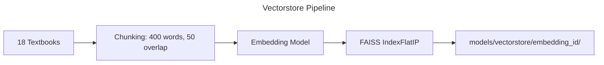

> [!NOTE]
> The live site with the agent is a static client with a Dialogflow ES chatbot interface. Please note that the backend server is not currently active, so the chatbot will not provide functional RAG-based medical answers; the link is provided to demonstrate the frontend implementation and conversational flow.

# Overview

EMMA is a conversational medical study agent for USMLE preparation. In explanation mode, students pose clinical questions in natural language and receive responses grounded in passages from 18 standard medical textbooks. In quiz mode, EMMA presents authentic USMLE-style questions, evaluates answers, and tracks per-specialty performance. A collaborative filtering recommender steers students toward their weakest areas.

# Architecture Pipeline



Clinical vignettes score lower in raw FAISS retrieval because incidental language ("A 45-year-old man presents with...") dilutes the embedding. NER rewriting isolates the DISEASE and CHEMICAL tokens before querying, improving retrieval scores by +0.005–0.006 on biomedical embeddings.

# Repository Structure

```plain
emma/
├── config/
│   └── models.json              # single source of truth: LLMs, embeddings, benchmark grid
├── data/
│   ├── MedQA-USMLE/
│   │   ├── questions/           # train/dev/test JSONL (10,178 / 1,273 / 1,273 questions)
│   │   └── textbooks/en/        # 18 medical textbooks (.txt)
│   └── MedMCQA/                 # train/validation/test parquet (182k questions)
├── models/
│   ├── vectorstore/             # FAISS index per embedding model (gitignored, ~143 MB each)
│   ├── classifier/              # tfidf_svm.pkl, label_encoder.pkl
│   ├── ner/                     # entity_stats.json, collocations, config.json
│   ├── clustering/              # BERTopic model
│   ├── recommender/             # ratings.csv, results.json
│   ├── rag/                     # per-run results.parquet + config.json
│   └── benchmarks.json          # ablation grid results (committed to git)
├── notebooks/
│   ├── 00_data_exploration.ipynb
│   ├── 01_vectorstore_build.ipynb
│   ├── 02_classification.ipynb
│   ├── 03_clustering.ipynb
│   ├── 04_rag_pipeline.ipynb
│   ├── 05_ner.ipynb
│   ├── 06_crs.ipynb
│   └── 07_evaluation_benchmark.ipynb
├── src/
│   ├── data.py                  # data loaders (MedQA, MedMCQA, textbooks)
│   ├── vectorstore.py           # FAISS build + search
│   ├── retrieval.py             # EMMARetriever: NER -> FAISS -> classify -> LLM
│   ├── classify.py              # classification pipeline
│   ├── cluster.py               # BERTopic evaluation
│   └── api.py                   # FastAPI webhook
├── client/                      # static web app (deployed on Vercel)
├── run_api.py                   # API server entrypoint
├── pyproject.toml
└── scripts/
    ├── setup.sh                 # Unix / WSL setup
    └── setup.ps1                # Windows PowerShell setup
```

# Notebooks

| #   | Notebook                        | Purpose                                                                  | Runs on        |
| --- | ------------------------------- | ------------------------------------------------------------------------ | -------------- |
| 0   | `00_data_exploration.ipynb`     | Dataset EDA: textbook sizes, MedQA/MedMCQA distributions                 | Local          |
| 1   | `01_vectorstore_build.ipynb`    | Chunk textbooks > embed > build FAISS index                              | Colab T4       |
| 2   | `02_classification.ipynb`       | Feature × classifier grid on MedMCQA, champion selection                 | Local or Colab |
| 3   | `03_clustering.ipynb`           | BERTopic + GMM + Spectral on MedQA questions                             | Local or Colab |
| 4   | `04_rag_pipeline.ipynb`         | End-to-end RAG pilot: NER → FAISS → LLM (50 questions)                   | **Colab T4**   |
| 5   | `05_ner.ipynb`                  | NER corpus analysis, collocation, retrieval score comparison             | Local          |
| 6   | `06_crs.ipynb`                  | Collaborative filtering recommender (SVD, NMF, KNNBasic)                 | Local          |
| 7   | `07_evaluation_benchmark.ipynb` | Full ablation grid: 6 combinations of embeddings × LLMs × RAG conditions | Colab T4       |

All notebooks auto-detect Colab and load artefacts from Google Drive. They resume from checkpoint if the session is interrupted.

# Data

Three sources, all committed to `data/`:

| #   | Dataset                                        | Questions             | Purpose                                    |
| --- | ---------------------------------------------- | --------------------- | ------------------------------------------ |
| 1   | [MedQA-USMLE](https://github.com/jind11/MedQA) | 12,723 (train 10,178) | RAG evaluation, clustering, NER analysis   |
| 2   | [MedMCQA](https://github.com/MedMCQA/MedMCQA)  | 179,777               | Classifier training (has specialty labels) |
| 3   | 18 medical textbooks                           | 36,723 chunks         | RAG retrieval corpus                       |

MedMCQA is used for classifier training only. Its `subject_name` labels provide the specialty ground truth that MedQA lacks. The textbooks were written by the same authors who wrote the MedQA questions, making them the ideal retrieval source.

```python
from src.data import load_medqa, load_medmcqa, load_all_textbooks
df    = load_medqa(split='train')   # 10,178 rows
books = load_all_textbooks()        # dict of 18 textbooks
```

# Vectorstore

## Relevant Files

| #   | File                                   | Purpose                 |
| --- | -------------------------------------- | ----------------------- |
| 1   | `src/vectorstore.py`                   | build + query functions |
| 2   | `notebooks/01_vectorstore_build.ipynb` | run once on Colab T4    |



Three vectorstores were built and evaluated (one per embedding model):

| #   | Embedding            | Dim  | RTEB Healthcare rank | Default                   |
| --- | -------------------- | ---- | -------------------- | ------------------------- |
| 1   | Octen-Embedding-0.6B | 1024 | #15                  | No (best ablation result) |
| 2   | Qwen3-Embedding-0.6B | 1024 | #177                 | Yes (build default)       |
| 3   | all-MiniLM-L12-v2    | 384  | —                    | No                        |

## Getting `vectorstore` Files

The index files are too large for git (~143 MB each). Three options:

1. **Download pre-built** — use the auto-download cell in NB01 Section 4 (pulls from shared Google Drive)
2. **Rebuild on Colab** — run NB01 on a T4 GPU (~45 min per embedding model)
3. **Local rebuild** — run NB01 locally if you have a GPU with ≥8GB VRAM

Place files under `models/vectorstore/<embedding_id>/`:

```plain
models/vectorstore/
  octen-embedding-0.6b/
    index.faiss
    texts.pkl
    metadata.pkl
    config.json
```

## Retrieval Quality

| #   | Query type                                         | Score range | Confidence band |
| --- | -------------------------------------------------- | ----------- | --------------- |
| 1   | Direct question (e.g. "anaphylaxis mechanism")     | 0.72–0.73   | high            |
| 2   | Direct question (e.g. "beta blocker side effects") | 0.72–0.73   | high            |
| 3   | Raw clinical vignette                              | 0.63–0.66   | medium          |
| 4   | NER-rewritten vignette (Octen)                     | 0.65–0.66   | medium          |

# NER & Query Rewriting

## Relevant Files

| #   | File                     | Purpose                                                                                                  |
| --- | ------------------------ | -------------------------------------------------------------------------------------------------------- |
| 1   | `src/retrieval.py`       | `NER_MODEL`, `ENTITY_LABELS`, `extract_entities()`, `rewrite_query()`, NER and query rewriting functions |
| 2   | `notebooks/05_ner.ipynb` | NER corpus analysis and retrieval score validation                                                       |

## NER Model

### Model Selection

`en_ner_bc5cdr_md` (BC5CDR corpus, 1,500 PubMed articles)

### Labels

- `DISEASE`
- `CHEMICAL`

> [!NOTE]
> **Why not `en_core_sci_md`?**
> That model outputs a single generic `ENTITY` label. It cannot distinguish between diseases and chemicals. `en_ner_bc5cdr_md` is the only ScispaCy model that produces typed biomedical entities suitable for query rewriting.

### Install

```bash
# Already in pyproject.toml, installed by uv sync
# To install manually:
pip install https://s3-us-west-2.amazonaws.com/ai2-s2-scispacy/releases/v0.5.4/en_ner_bc5cdr_md-0.5.4.tar.gz
```

### Corpus Statistics (MedQA train, 10,178 questions)

- 54,256 total entities extracted
- DISEASE: 39,575 | CHEMICAL: 14,681
- Mean 5.33 entities per question
- 593 questions (5.8%) have zero entities → fall back to raw query

### NER Rewriting Impact on FAISS Retrieval Score

| #   | Embedding            | Raw vignette | NER rewrite | Delta  |
| --- | -------------------- | ------------ | ----------- | ------ |
| 1   | all-MiniLM-L12-v2    | 0.5412       | 0.5191      | -0.022 |
| 2   | Qwen3-Embedding-0.6B | 0.6379       | 0.6431      | +0.005 |
| 3   | Octen-Embedding-0.6B | 0.6525       | 0.6584      | +0.006 |

NER rewriting helps biomedical-scale embeddings and hurts general-purpose ones. Model and NER strategy must be co-designed.

# Classification

## Relevant Files

| #   | File                                  | Purpose                                   |
| --- | ------------------------------------- | ----------------------------------------- |
| 1   | `src/classify.py`                     | feature pipelines, CV, training           |
| 2   | `notebooks/02_classification.ipynb`   | full feature × classifier grid            |
| 3   | `models/classifier/tfidf_svm.pkl`     | fitted champion pipeline (TF-IDF + SVM)   |
| 4   | `models/classifier/label_encoder.pkl` | fitted LabelEncoder for specialty classes |

## Task

19-class specialty prediction on MedMCQA questions. Used to route each query to the correct specialty context at inference time.

## Champion: TF-IDF Bigrams + LinearSVC

| #   | Metric      | 10-fold CV (20k sample) | Holdout (full 179k) |
| --- | ----------- | ----------------------- | ------------------- |
| 1   | Weighted F1 | 0.5424 ± 0.0086         | 0.69                |
| 2   | Cohen's κ   | 0.5089 ± 0.0096         | 0.66                |

Mean inter-category cosine similarity: 0.72 (vs. ~0.95 in the A1 corpus), confirming the task is tractable for a linear classifier.

# Clustering

## Relevant Files

| #   | File                            | Purpose                        |
| --- | ------------------------------- | ------------------------------ |
| 1   | `src/cluster.py`                | BERTopic evaluation helpers    |
| 2   | `notebooks/03_clustering.ipynb` | clustering analysis and models |

## Method

BERTopic (MiniLM-L12-v2 embeddings → UMAP → HDBSCAN). Auto-discovers K=55 topics.

| #   | Method                | Cohen's $\kappa$ | Silhouette | $C_v$ coherence |
| --- | --------------------- | ---------------: | ---------: | --------------: |
| 1   | TF-IDF + GMM          |           0.0193 |          — |               — |
| 2   | Embeddings + Spectral |           0.0192 |     0.0605 |               — |
| 3   | BERTopic              |          -0.0117 |      0.069 |          0.5088 |

## Interpretation of Near-Zero $\kappa$

BERTopic discovers 55 fine-grained topic groups that do not align one-to-one with 19 specialty labels. This is granularity mismatch, not failure. C_v = 0.5088 confirms internal topic coherence. Topic 0 (chest/cardiac terms) is 70.6% Internal Medicine; Topic 4 (gestation/pregnancy) is 72.4% Obstetrics. The 34.7% outlier rate reflects short question stems (~20 words) that don't form dense HDBSCAN clusters — these fall back to specialty-only routing.

# Recommender System

## Relevant Files

| #   | File                     | Purpose                        |
| --- | ------------------------ | ------------------------------ |
| 1   | `notebooks/06_crs.ipynb` | Recommender system development |
| 2   | `models/recommender/`    | ratings, results, and config   |

## Task

Recommend which specialties a student should focus on, based on their quiz history. Collaborative filtering finds latent weakness patterns across students.

## Algorithms Evaluated

| #   | Algorithm       | Type                            |
| --- | --------------- | ------------------------------- |
| 1   | SVD             | Matrix factorization            |
| 2   | NMF             | Matrix factorization            |
| 3   | KNNBasic        | Memory-based                    |
| 4   | NormalPredictor | Baseline (predicts mean rating) |

## Evaluation

Used a synthetic dataset of 200 students with randomized quiz histories. Evaluated on RMSE and Hit Rate @ K (whether the model's top K recommendations include at least one of the student's actual weak specialties).

## Champion: KNNBasic

| #   | Metric           | KNNBasic | NormalPredictor |
| --- | ---------------- | -------: | --------------: |
| 1   | RMSE (5-fold CV) |   0.2208 |          0.3109 |
| 2   | Hit Rate @ 5     |   0.3350 |               — |
| 3   | Hit Rate @ 10    |   0.7400 |               — |

KNNBasic successfully identifies at least one of a student's weak specialties for 74% of students at K=10. Precision@K is capped at ~0.60 because students only have 3–4 weak specialties. Perfect P@5 is impossible when there are fewer weak specialties than K.

# RAG Pipeline & Benchmarks

## Relevant Files

| #   | File                                      | Purpose                                               |
| --- | ----------------------------------------- | ----------------------------------------------------- |
| 1   | `notebooks/04_rag_pipeline.ipynb`         | pilot run (50 questions, Qwen3-4B)                    |
| 2   | `notebooks/07_evaluation_benchmark.ipynb` | full ablation grid                                    |
| 3   | `models/benchmarks.json`                  | all run results                                       |
| 4   | `config/models.json`                      | `benchmark_combinations` array defines the exact grid |

## Benchmark combinations

This is defined in `config/models.json > benchmark_combinations`.

| #     | Embedding Model          | LLM                   | RAG   | n_eval  | Accuracy | Delta     |
| ----- | ------------------------ | --------------------- | ----- | ------- | -------- | --------- |
| 1     | Qwen3-Embedding-0.6B     | Qwen3-4B              | ✗     | 50      | 42%      | —         |
| 2     | Qwen3-Embedding-0.6B     | Qwen3-4B              | ✓     | 50      | 38%      | -4pp      |
| 3     | Qwen3-Embedding-0.6B     | Qwen3-4B-Thinking     | ✗     | 100     | 31%      | —         |
| 4     | Qwen3-Embedding-0.6B     | Qwen3-4B-Thinking     | ✓     | 100     | 32%      | +1pp      |
| 5     | Octen-Embedding-0.6B     | Qwen3-4B-Thinking     | ✗     | 100     | 33%      | —         |
| **6** | **Octen-Embedding-0.6B** | **Qwen3-4B-Thinking** | **✓** | **100** | **44%**  | **+11pp** |

## Finding

RAG effectiveness is embedding- and LLM-dependent. A general-purpose embedding (MiniLM) or standard LLM hurts performance. A biomedical embedding (Octen, RTEB Healthcare rank #15) paired with a reasoning-capable LLM (Qwen3-4B-Thinking-2507) gives +11pp. NER rewriting is necessary but not sufficient — the LLM must also be capable of using the retrieved context.

# FastAPI Backend

## Relevant Files

| #   | File         | Purpose                          |
| --- | ------------ | -------------------------------- |
| 1   | `src/api.py` | FastAPI app                      |
| 2   | `run_api.py` | server entrypoint with CLI flags |

## Endpoints

| #   | Method | Path          | Description                                        |
| --- | ------ | ------------- | -------------------------------------------------- |
| 1   | GET    | `/health`     | Service health, backend info, feature flags        |
| 2   | POST   | `/webhook`    | Dialogflow ES webhook (two-turn async RAG pattern) |
| 3   | POST   | `/chat`       | Direct EMMA query: full RAG, no Dialogflow timeout |
| 4   | POST   | `/query`      | Developer testing endpoint                         |
| 5   | GET    | `/conditions` | Lists evaluation-domain conditions                 |

## Two-Turn Async Pattern

Dialogflow ES enforces a 5-second response timeout. LLM inference takes 8–90 seconds. The webhook immediately returns an acknowledgment ("Looking that up...") and fires RAG as a background task. On the next user message, it delivers the completed answer. This gives real RAG responses through Dialogflow with zero timeouts.

# Setup

## Prerequisites

- Python 3.11+
- [uv](https://docs.astral.sh/uv/) — `curl -LsSf https://astral.sh/uv/install.sh | sh`
- [Ollama](https://ollama.com) — for local LLM inference (optional but recommended)
- [ngrok](https://ngrok.com) — for exposing the API to Dialogflow (optional)

## Install

```bash
git clone https://github.com/jaxendutta/emma.git
cd emma

# Unix / WSL
bash scripts/setup.sh

# Windows PowerShell
scripts\setup.ps1
```

The setup script:

1. Creates a `.venv` and installs all dependencies via `uv sync`
2. Installs both SpaCy biomedical models (`en_core_sci_md` + `en_ner_bc5cdr_md`)
3. Registers the Jupyter kernel (`emma`)
4. Verifies the `src` package is importable

## Environment variables

Copy `.env.example` to `.env` and fill in as needed:

```bash
cp .env.example .env
```

```env
HF_TOKEN=hf_your_token_here     # required only for gated models
EMMA_USE_RAG=true               # enable RAG pipeline in the API
EMMA_MODEL_ID=qwen3-4b          # override default LLM (optional)
EMMA_OLLAMA_URL=http://localhost:11434
```

## Pull the LLM (Ollama)

```bash
ollama pull qwen3:4b-thinking-2507-q4_K_M   # champion model (~2.5 GB)
ollama pull qwen3:4b                         # standard variant (~2.5 GB)
```

## Open notebooks

```bash
uv run jupyter notebook notebooks/
```

Select the `EMMA` kernel when prompted.

# Running the API Locally

## Start the server

```bash
# Static knowledge only (no LLM, instant startup)
uv run python run_api.py

# Full RAG pipeline
uv run python run_api.py --rag

# Specify model and port
uv run python run_api.py --rag --model qwen3-4b --port 8000

# Production mode (no auto-reload)
uv run python run_api.py --rag --no-reload
```

The server starts at `http://localhost:8000`. Check `http://localhost:8000/health` to confirm it's running and inspect backend status.

## Expose to Dialogflow via ngrok

Dialogflow requires a public HTTPS URL to reach your webhook. ngrok creates a secure tunnel from a public URL to your local server.

**1. Install ngrok and authenticate:**

```bash
# Install: https://ngrok.com/download
ngrok authtoken YOUR_NGROK_TOKEN    # get token at dashboard.ngrok.com
```

**2. In a separate terminal, start the tunnel:**

```bash
ngrok http 8000
```

ngrok will print a URL like `https://abc123.ngrok-free.app`. Copy it.

**3. Update Dialogflow:**

- Go to your Dialogflow ES agent → Fulfillment → Webhook
- Set URL to: `https://abc123.ngrok-free.app/webhook`
- Save, then re-enable webhook fulfillment on each intent

> [!NOTE]
> The ngrok URL changes every time you restart ngrok on the free plan. You'll need to update Dialogflow each session. The paid plan ($10/month) gives you a static domain.
>
> **Session limits:** Free Colab cuts out after 12 hours (hard limit) and 90 minutes of inactivity. Run both `run_api.py` and the ngrok tunnel from your local machine if you want a longer-lived session. The Vercel static client works independently of the API:  Dialogflow's cloud servers handle the chatbot even when your local API is offline.

## Test Directly (No DialogFlow)

```bash
curl -X POST http://localhost:8000/query \
  -H "Content-Type: application/json" \
  -d '{"query": "What is the mechanism of anaphylaxis?", "use_rag": true}'
```

# Key Design Decisions

| #   | Decision                                     | Rationale                                                                                                                                                                    |
| --- | -------------------------------------------- | ---------------------------------------------------------------------------------------------------------------------------------------------------------------------------- |
| 1   | Textbooks as RAG corpus                      | MedQA questions were written from these 18 textbooks — the ideal retrieval source. Faster and more reproducible than live PubMed querying.                                   |
| 2   | `en_ner_bc5cdr_md` for NER                   | Only ScispaCy model with typed DISEASE + CHEMICAL labels. `en_core_sci_md` produces a single generic ENTITY label — unsuitable for typed extraction.                         |
| 3   | Octen-Embedding-0.6B as production embedding | RTEB Healthcare rank #15, ablation validated (+11pp RAG delta). Qwen3-Embedding is the build default due to earlier availability.                                            |
| 4   | Qwen3-4B-Thinking-2507 as production LLM     | Medmarks rank #33 in tiny model category. The thinking variant is required for RAG — the standard Qwen3-4B cannot effectively use retrieved context (ablation result: -4pp). |
| 5   | Separation of concerns                       | The ML pipeline makes deterministic routing decisions; the LLM generates explanations only. Routing is auditable and fast; generation is where latency lives.                |
| 6   | `benchmark_combinations` in `models.json`    | Explicit grid declaration avoids accidental cross-product runs. The ablation loop iterates exactly what is declared — no more, no less.                                      |
| 7   | Stratified CV subsampling                    | 20k stratified sample for model selection; champion retrained on full 179k corpus. The CV-to-holdout gap (0.54 → 0.69 F1) is expected and documented.                        |
| 8   | Score thresholding + confidence bands        | Chunks below 0.40 are dropped; 0.40–0.55 flagged as "low confidence"; 0.55–0.70 as "medium". The LLM is instructed not to rely on low-confidence sources.                    |
| 9   | Two-turn async webhook                       | Dialogflow ES has a 5-second deadline; LLM inference takes 8–90 seconds. The webhook returns an acknowledgment immediately and delivers the RAG answer on the next turn.     |

# References

1. Campello, R. J. G. B., Moulavi, D., and Sander, J. 2013. Density-based clustering based on hierarchical density estimates. In Proceedings of the 17th Pacific-Asia Conference on Knowledge Discovery and Data Mining (PAKDD), 160–172. https://doi.org/10.1007/978-3-642-37456-2_14

2. Fan, R.-E., Chang, K.-W., Hsieh, C.-J., Wang, X.-R., and Lin, C.-J. 2008. LIBLINEAR: A library for large linear classification. Journal of Machine Learning Research 9 (2008), 1871–1874. https://jmlr.org/papers/v9/fan08a.html

3. Grootendorst, M. 2022. BERTopic: Neural topic modeling with a class-based TF-IDF procedure. arXiv preprint arXiv:2203.05794. https://doi.org/10.48550/arXiv.2203.05794

4. Hug, N. 2020. Surprise: A Python library for recommender systems. Journal of Open Source Software 5, 52 (2020), 2174. https://doi.org/10.21105/joss.02174

5. Jin, D., Pan, E., Oufattole, N., Weng, W.-H., Fang, H., and Szolovits, P. 2021. What disease does this patient have? A large-scale open domain question answering dataset from medical exams. Applied Sciences 11, 14 (2021), 6421. https://doi.org/10.3390/app11146421

6. Johnson, J., Douze, M., and Jégou, H. 2019. Billion-scale similarity search with GPUs. IEEE Transactions on Big Data 7, 3 (2019), 535–547. https://doi.org/10.1109/TBDATA.2019.2921572

7. Li, J., Sun, Y., Johnson, R. J., Sciaky, D., Wei, C.-H., Leaman, R., Davis, A. P., Mattingly, C. J., Wiegers, T. C., and Lu, Z. 2016. BioCreative V CDR task corpus: a resource for chemical disease relation extraction. Database 2016 (2016), baw068. https://doi.org/10.1093/database/baw068

8. McInnes, L., Healy, J., and Melville, J. 2018. UMAP: Uniform manifold approximation and projection for dimension reduction. arXiv preprint arXiv:1802.03426. https://doi.org/10.48550/arXiv.1802.03426

9. Neumann, M., King, D., Beltagy, I., and Ammar, W. 2019. ScispaCy: Fast and robust models for biomedical natural language processing. In Proceedings of the 18th BioNLP Workshop, 319–327. https://doi.org/10.18653/v1/W19-5034

10. Pal, A., Umapathi, L. K., and Sankarasubbu, M. 2022. MedMCQA: A large-scale multi-subject multi-choice dataset for medical domain question answering. In Proceedings of the Conference on Health, Inference, and Learning (CHIL), PMLR 174, 248–260. https://proceedings.mlr.press/v174/pal22a.html

11. Pedregosa, F., Varoquaux, G., Gramfort, A., Michel, V., Thirion, B., Grisel, O., Blondel, M., Prettenhofer, P., Weiss, R., Dubourg, V., Vanderplas, J., Passos, A., Cournapeau, D., Brucher, M., Perrot, M., and Duchesnay, É. 2011. Scikit-learn: Machine learning in Python. Journal of Machine Learning Research 12 (2011), 2825–2830. https://jmlr.org/papers/v12/pedregosa11a.html

12. Rezaei, M. R., Saadati Fard, R., Parker, J. L., Krishnan, R. G., and Lankarany, M. 2025. Agentic medical knowledge graphs enhance medical question answering: bridging the gap between LLMs and evolving medical knowledge. In Findings of the Association for Computational Linguistics: EMNLP 2025, 12682–12701. Association for Computational Linguistics. https://doi.org/10.18653/v1/2025.findings-emnlp.679
