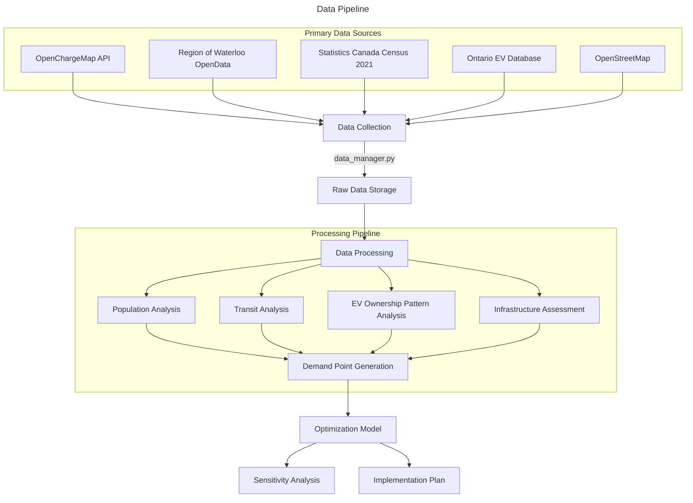
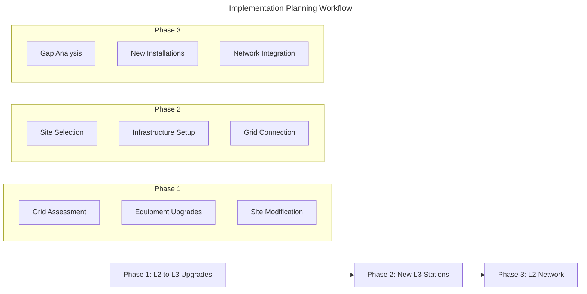

# Project Overview

A comprehensive mixed-integer linear programming (MILP) optimization model for strategic enhancement of the Kitchener-Waterloo Census Metropolitan Area (KWC-CMA) electric vehicle charging network. This project combines real-world data sources, advanced spatial analysis, and multi-objective optimization to recommend optimal charging infrastructure placement and upgrades.

## Geographic Scope
The project covers the entire KWC-CMA region including:
- Major Cities: Kitchener, Waterloo, Cambridge
- Townships: Woolwich, Wilmot, North Dumfries, Wellesley
- Total Area: 1,092.33 km²
- Population: 637,730 (Region of Waterloo Data)
- Key Features: Dense urban cores, suburban areas, rural communities

## Core Strategies

1. **L2 to L3 Conversion**
   - Identification of high-impact L2 stations for L3 upgrades based on:
     - Current utilization patterns
     - Grid infrastructure capacity
     - Population density and EV ownership
     - Implementation feasibility
   - Cost-benefit analysis incorporating:
     - Installation costs
     - Grid upgrade requirements
     - Expected usage patterns
     - Revenue potential
     - L2 port retention costs

2. **Port retention**
     - Retains minimum L2 ports for non-L3 compatible vehicles
     - Sell excess L2 ports based on L3 space requirements
     - Optimize total port capacity
     - Balances upgrade costs with equipment resale value
     - Preserves charging accessibility for all vehicle types

3. **Network Coverage Enhancement**
   - Population coverage maximization through:
     - Demographic-weighted demand analysis
     - EV ownership pattern integration
     - Multi-modal transit accessibility
     - Future growth consideration
   - Service area optimization considering:
     - Walking distance for urban areas
     - Driving distance for L3 chargers
     - Transit hub integration
     - Grid capacity constraints

4. **Infrastructure Optimization**
   - Data-driven port allocation:
     - Usage pattern analysis
     - Peak demand consideration
     - Grid capacity limits
     - Expansion potential
   - Location selection based on:
     - Population density
     - EV ownership patterns
     - Transit accessibility
     - Grid infrastructure

5. **Comprehensive Network Planning**
    Multi-objective optimization balancing:
   - Coverage maximization
   - Cost minimization
   - Grid capacity constraints
   - Implementation feasibility
   - Phased implementation strategy:
     - Priority upgrades
     - Coverage gap filling
     - Future expansion preparation

6. **Implementation Planning**
   - Phased approach with carefully managed transitions
   - Maintains service continuity during upgrades
   - Strategic port allocation across network
   - Infrastructure readiness assessment

# Methodology and Data Pipeline



## Data Collection and Integration
The project follows a systematic data collection approach implemented in `data_manager.py`:

### Geographic & Infrastructure Data
- **Boundary Data**: 
  - Source: [Region of Waterloo Open Data](https://rowopendata-rmw.opendata.arcgis.com)
  - Process: UTM Zone 17N projection for accurate measurements
  - Validation: Geometric integrity checks, coordinate system verification

- **Charging Infrastructure**:
  - Source: [OpenChargeMap API](https://openchargemap.org)
  - Current Network: 183 stations (169 Level 2, 18 Level 2)
  - Details: Port configurations, operator data, power specifications
  - Processing: Grid capacity analysis, geocoding validation

- **Potential Locations**:
  - Source: [OpenStreetMap](https://www.openstreetmap.org) via [OSMnx](https://osmnx.readthedocs.io)
  - Categories: Commercial centers, parking facilities, public venues
  - Analysis: Land use compatibility, grid proximity, site suitability
  - Scoring: Multi-factor location scoring implemented in `02_location_analysis.ipynb`

### Population and EV Data
- **Census Data (2021)**:
  - Sources: [Statistics Canada](https://www12.statcan.gc.ca/census-recensement/2021/dp-pd/prof/details/page.cfm?DGUIDlist=2021S0503541), [Region of Waterloo Open Data](https://rowopendata-rmw.opendata.arcgis.com)
  - Level: Census tract granularity
  - Metrics: Population density, housing characteristics, demographic factors
  - Integration: UTM projection alignment, spatial joins

- **EV Ownership Patterns**:
  - Source: [Ontario FSA-level EV database](https://data.ontario.ca/dataset/electric-vehicles-in-ontario-by-forward-sortation-area)
  - Coverage: All KWC-CMA FSA codes
  - Processing: 
    - Density calculations per FSA
    - BEV/PHEV ratio analysis
    - Spatial distribution mapping
    - Growth trend projections

### Transit Network Data
- **Source**: [Grand River Transit Open Data](https://www.grt.ca/en/about-grt/open-data.aspx)
- **Components**:
  - GRT Bus routes and stops
  - ION LRT infrastructure
  - Service frequency data
  - Coverage area analysis
- **Integration**: Multi-modal accessibility scoring

## Analysis Pipeline
Our analysis workflow, implemented across multiple notebooks, processes raw data into optimization inputs:

### Location Analysis
Notebook: `02_location_analysis.ipynb`
  - Population distribution analysis
  - Transit accessibility scoring
  - Demographic pattern identification
  - Service area calculations

### Enhancement Analysis
Notebook: `03_enhancement_analysis.ipynb`
  - Identification of upgrade candidates
  - Port retention calculations
  - Cost-benefit analysis with retained ports
  - Grid capacity verification
  - Implementation feasibility assessment

### Data Preparation
Notebook: `04_data_preparation.ipynb`
  - Demand point generation
  - Constraint parameter calculation
  - Distance matrix computation
  - Site suitability scoring

## Demand Point Generation
The project creates sophisticated demand points to represent charging needs through a multi-factor analysis.

```mermaid
---
title: Demand Point Generation Workflow
---
graph LR
    A[Census Tracts] --> |Population Weighting| B[Base Points]
    C[Transit Data] --> |Accessibility Score| D[Transit Factor]
    E[EV Ownership] --> |Density Analysis| F[EV Factor]
    G[Infrastructure] --> |Quality Assessment| H[Infrastructure Factor]
    
    B --> I[Demand Points]
    D --> I
    F --> I
    H --> I
    
    I --> |Score Calculation| J[Final Weighted Points]
  ```

### Population-Based Points: Base Generation
  - Census tract centroids as initial points
  - Population-weighted adjustments
  - Density-based clustering
  - Service area calculations

### EV Integration: FSA Data Processing
  - Data from 14 FSA regions in KWC-CMA
  - Downscaling to census tract level
  - BEV/PHEV ratio consideration
  - Growth trend incorporation

### Scoring Components
  - EV Ownership Data (35%)
  - Infrastructure quality (25%)
  - Base population density (20%)
  - Transit accessibility (15%)
  - Infrastructure Age (5%)

# Technical Implementation

## Optimization Model Architecture

### Core Components
- **Model Type**: Multi-Objective Mixed-Integer Linear Programming (MILP)
- **Solver**: Gurobi Optimizer (Academic WLS License)
- **Implementation**: `network_optimizer.py`
- **Key Features**:
   - Port retention constraints
   - Budget-aware planning with resale consideration
   - Grid capacity constraints
   - Coverage requirements with dual charging types

### Decision Framework
- **Station Decisions**:
  - New L2/L3 station placement
  - L2 to L3 conversions with port retention
  - Station type selection
  - Coverage optimization

- **Coverage Analysis**:
  - Population coverage tracking
  - EV owner accessibility
  - Service level guarantees
  - Future growth accommodation

### Constraint Structure
- **Infrastructure Limits**:
  - Grid capacity per location
  - Maximum stations per area
  - Minimum distance requirements
  - Port allocation rules

- **Coverage Requirements**:
  - Minimum population coverage
  - EV owner accessibility
  - Transit integration targets
  - Service redundancy

## Data Processing Pipeline

### Raw Data Processing
- **Data Manager**
    
    Script: `data_manager.py`
  - API integrations (OpenChargeMap, Census)
  - Spatial data processing
  - Caching mechanisms
  - Error handling

- **Preprocessing Steps**
  - Coordinate validation
  - Missing data handling
  - Projection standardization
  - Spatial indexing

### Analysis Workflow
- **Location Analysis**
  - Population density mapping
  - Transit accessibility scoring
  - Land use compatibility
  - Grid capacity assessment

- **Enhancement Analysis**
  - Current coverage evaluation
  - Upgrade opportunity identification
  - Cost-benefit calculations
  - Implementation feasibility

### Optimization Preparation
- **Input Generation**
  - Demand point creation
  - Distance matrix computation
  - Constraint parameter calculation
  - Cost modeling

- **Solution Analysis**
  - Coverage metrics
  - Financial impact
  - Implementation phasing
  - Sensitivity testing

## Optimization Implementation

```mermaid
---
title: Optimization Workflow
---
graph TD
    A[Input Data] --> B[Problem Setup]
    B --> C[Initial Solution]
    
    subgraph "Optimization Loop"
        C --> D[Coverage Check]
        D --> E[Cost Analysis]
        E --> F[Grid Constraints]
        F --> G[Solution Update]
        G --> D
    end
    
    G --> |Convergence| H[Final Solution]
    H --> I[Implementation Planning]
    H --> J[Sensitivity Analysis]
```

### Model Configuration
Script: `network_optimizer.py`
- **Decision Variables**
  - Binary variables for station decisions
  - Integer variables for port allocation
  - Coverage tracking variables
  - Cost accounting variables

- **Model Parameters**
  - Grid capacity thresholds
  - Coverage radius requirements
  - Budget constraints
  - Minimum port requirements

### Solution Process
- **Setup Phase**
  - Data structure preparation
  - Variable initialization
  - Constraint generation
  - Objective function formulation

- **Solution Strategy**
  - Multi-phase optimization
  - Iterative refinement
  - Feasibility checking
  - Solution validation

## Results Processing and Analysis

### Coverage Analysis 
Notebook: `05_optimization_model.ipynb`
- **Geographic Coverage**
  - Population accessibility metrics
  - EV owner coverage calculations
  - Transit integration assessment
  - Service gap identification

- **Infrastructure Distribution**
  - Charger type analysis
  - Port allocation efficiency
  - Grid capacity utilization
  - Service redundancy evaluation

### Financial Analysis
- **Cost Breakdown**
  - Installation expenses
  - Infrastructure upgrades
  - Grid capacity enhancements
  - Operating cost projections

- **ROI Calculations**
  - Coverage improvement metrics
  - Cost per capita served
  - Efficiency improvements
  - Long-term value assessment

## Implementation Planning



### Phased Deployment
- **Phase 1: Strategic Upgrades**
  - Timeframe: Months 1-4
  - Focus: L2 to L3 conversions
  - Activities: 
    - Grid capacity upgrades
    - Equipment installation
    - Site preparation

- **Phase 2: Network Expansion**
  - Timeframe: Months 5-8
  - Focus: New L3 installations
  - Activities:
    - Site development
    - Infrastructure setup
    - Grid connections

- **Phase 3: Coverage Enhancement**
  - Timeframe: Months 9-12
  - Focus: L2 network completion
  - Activities:
    - Gap filling
    - Accessibility improvements
    - Network optimization

### Technical Requirements
- **Grid Infrastructure**:
  - Power capacity analysis
  - Transformer requirements
  - Protection systems
  - Monitoring equipment

- **Site Preparation**:
  - Surface modifications
  - Accessibility improvements
  - Signage and markings
  - Safety features

## Visualization and Reporting

### Interactive Maps 
Script: `map_viz.py`
- **Coverage Visualization**
  - Population density heatmaps
  - Service area overlays
  - Station status indicators
  - Implementation phase mapping

- **Analysis Layers**
  - EV ownership density
  - Transit accessibility
  - Grid capacity zones
  - Upgrade priorities

### Results Dashboard
- **Performance Metrics**
  - Coverage improvements
  - Cost efficiency
  - Implementation progress
  - Service level achievements

- **Analysis Views**
  - Geographic distribution
  - Financial analysis
  - Timeline tracking
  - Impact assessment

## Port Retention Strategy

The model employs a sophisticated port retention strategy during L2 to L3 upgrades:

1. **Retention Logic**
   - Maintains minimum required L2 ports (`min_ports_per_l2`) at upgraded stations, which is reasonably set as `1`.
   - Ensures charging accessibility for non-L3 compatible vehicles
   - Balances retention with L3 space requirements

2. **Cost Considerations**
   - Selective resale of excess L2 ports
   - Optimizes between retention benefits and upgrade costs
   - Factors in resale value of removed ports
   - Considers installation costs for new L3 infrastructure

3. **Implementation Impact**
   - Phased transition that maintains service continuity
   - Balanced distribution of charging options
   - Future-proof infrastructure development
   - Grid capacity optimization

4. **Design Rationale**
   - No assumption of total space availability
   - Flexible adaptation to site conditions
   - Priority on maintaining service accessibility
   - Cost-effective infrastructure evolution

# Getting Started

## Environment Setup

### Prerequisites
- Python>=3.12.7
- Gurobi Optimizer License
- OpenChargeMap API key

### Core Dependencies

1. **Core Data Processing**
   - `numpy`
   - `pandas`
   - `scipy`
   - `lxml`
   - `scikit-learn`

1. **Geospatial Analysis**
   - `geopandas`
   - `pyproj`
   - `shapely`
   - `osmnx`
   - `haversine`

1. **Optimization**
   - `gurobipy`

1. **Visualization**
   - `matplotlib`
   - `folium`
   - `branca`
   - `seaborn`

1. **API & Network**
   - `requests`
   - `ratelimit`
   - `python-dotenv`
   - `fastparquet`

1. **Progress & Formatting**
   - `tqdm`
   - `tabulate`
  
1. **Jupyter Environment**
   - `jupyter`

## Installation

1. **Clone repository**
    ```bash
    git clone https://github.com/username/kw-ev-charging-optimization.git
    cd kw-ev-charging-optimization
    ```

1. **Configure API Access**
   - Obtain an OpenChargeMap API key [here](https://openchargemap.org/site/developerinfo)
   - Acquire Ontario Data Portal access (if necessary)
   - Create a file named `.env` in your project root
   - Set up your API keys as environment variables by placing the following in the `.env` file:
     ```
     OCMAP_API_KEY=<your_api_key_here>
     # Any other necessary keys in format: <KEY_NAME>=<key>
     ```

1. **Run setup verification**
    ```bash
    python src/verify_setup.py
    ```

    The `verify_setup.py` script automates the setup process by:
    - Checking and enforcing project-specific virtual environment setup at `PROJECT_ROOT/venv`
    - Verifying Python version compatibility (requires Python 3.12.7+)
    - Installing the project package in editable mode using `pip install -e .`
    - Installing all dependencies from `requirements.txt` with proper categorization
    - Verifying Gurobi license status
    - Checking API key configurations
    - Testing API connectivity (OpenStreetMap, OpenChargeMap, ROW OpenData)
    - Validating source code file structure
    - Creating all necessary project directories

    The script provides interactive prompts and clear instructions if any setup steps fail or require user action. Follow the on-screen instructions to complete any missing setup requirements.

## Model Configuration

### Basic Configuration
- Located in `configs/base.json`
- Key parameters:
  - Cost factors
  - Coverage requirements
  - Grid constraints
  - Implementation phases

### Scenario Configuration
- Located in `configs/scenarios/`
- Available scenarios:
  - `aggressive.json`
  - `balanced.json`
  - `conservative.json`

## Quick Run on the CLI

> [!NOTE]
> This section is to run the optimization directly on the command line interface. If you would like to visualize and observe the data pipeline working its way through, you can skip to section [4.5.](#45-data-pipeline-execution). The following content is just for a quick run.

For a quick run of the optimization model after setting up your cconfigurations in the `config\` directory, run the following script.

```bash
# Basic run with default configuration
python src/run_optimization.py

# Run with specific scenario
python src/run_optimization.py --scenario balanced

# Run with custom output directory
python src/run_optimization.py --output custom_results
```

If run successfully, you would get a results package with the following components.

```plaintext
results/
  └── results_YYYYMMDD_HHMMSS/
      ├── config.json
      │
      ├── implementation_plan.json
      ├── implementation_plan.png
      ├── implementation_plan.txt
      │
      ├── optimization.log
      │
      ├── program.json
      ├── program.txt
      │
      ├── sensitivity_analysis.json
      ├── sensitivity_analysis.png
      ├── sensitivity_analysis.txt
      │
      ├── solution.json
      ├── solution.png
      ├── solution.txt
      └── solution_map.html
```

If the run fails, the error message would be logged in the `optimization.log` file. If this log file is empty, you have run the script successfully.

## Data Pipeline Execution

> [!TIP]
> If you want to run the optimization directly, you can check out section [4.4.](#44-quick-run-on-the-command-line-interface). The following content is just for visualizing the optimization steps and is not necessary to run the optimization script.

### Data Collection
```bash
jupyter notebook notebooks/01_data_collection.ipynb
```

### Analysis Pipeline
```bash
# Execute notebooks in order:
jupyter notebook notebooks/02_location_analysis.ipynb
jupyter notebook notebooks/03_enhancement_analysis.ipynb
jupyter notebook notebooks/04_data_preparation.ipynb
```

## Running the Optimization

The optimization can also be executed using a Jupyter Notebook. This method emphasizes immediate visualization of results.

> [!NOTE] 
> This notebook does not include predefined cells or code for saving outputs. However, you can add cells to save your results as needed. Currently, only the optimization script in section [4.4.](#44-quick-run-on-the-command-line-interface) saves a results pacakge as outlined.

```bash
jupyter notebook notebooks/05_optimization_model.ipynb
```

## Results Analysis

### Solution Visualization
- Interactive maps showing:
  - Current coverage
  - Proposed changes
  - Implementation phases
  - Service areas

### Performance Metrics
- Coverage improvement
- Cost efficiency
- Implementation timeline
- Technical feasibility

# Project Structure & Standards

## Directory Structure
```plaintext
ROOT/
├── data/                             # Data storage
│   ├── raw/                          # Raw data files
│   │   ├── boundaries/               # Geographic boundaries
│   │   ├── charging_stations/        # Station data
│   │   ├── ev_fsa/                   # EV ownership data
│   │   ├── population/               # Census data
│   │   └── potential_locations/      # Candidate sites
│   │
│   └── processed/                    # Processed datasets
│       ├── demand_points/            # Generated demand points
│       ├── ev_fsa_analyzed/          # Analyzed EV data
│       ├── integrated_analyzed_data/ # Combined analysis
│       └── optimization_inputs/      # Model inputs
│
├── notebooks/                        # Analysis notebooks
│   ├── 01_data_collection.ipynb
│   ├── 02_location_analysis.ipynb
│   ├── 03_enhancement_analysis.ipynb
│   ├── 04_data_preparation.ipynb
│   └── 05_optimization_model.ipynb
│
├── src/                              # Source code
│   ├── run_optimization.py           # Run model on the terminal
│   ├── verify_setup.py               # Verify environment setup
│   │
│   ├── data/                         # Data processing
│   │   ├── constants.py              # Project constants
│   │   ├── data_manager.py           # Data handling
│   │   └── utils.py                  # Utility functions
│   │
│   ├── model/                        # Optimization model
│   │   ├── network_optimizer.py      # Core optimizer
│   │   └── utils.py                  # Model utilities
│   │
│   └── visualization/                # Visualization tools
│       ├── map_viz.py                # Mapping functions
│       └── optimization_viz.py       # Result visualization
│
├── configs/                          # Configuration files
│   ├── base.json                     # Base configuration
│   └── scenarios/                    # Scenario configs
│
├── tests/                            # Unit tests
│
├── requirements.py
└── setup.py
```

## Code Standards

### Style Guidelines
- PEP 8 compliance
- Type hints for all functions
- Comprehensive docstrings
- Clear variable naming
- Exception handling patterns

### Documentation Standards
- Function documentation:
  - Purpose and description
  - Parameter types
  - Return values
  - Example usage
- Module documentation:
  - Purpose
  - Dependencies
  - Key classes/functions
  - Usage examples

## Troubleshooting Guide

### Common Issues
- **Data Loading Errors**:
  - Check API key configuration
  - Verify file paths in constants.py
  - Ensure proper data directory structure
  - Validate input file formats

- **Optimization Issues**:
  - Verify Gurobi license
  - Check constraint feasibility
  - Monitor memory usage
  - Review problem scale

- **Visualization Errors**:
  - Confirm coordinate systems
  - Check projection transformations
  - Verify data completeness
  - Monitor memory constraints

### Performance Optimization
- **Data Processing**:
  - Use spatial indexing
  - Implement caching
  - Optimize queries
  - Batch processing

- **Model Performance**:
  - Problem decomposition
  - Parameter tuning
  - Memory management
  - Solution warm-starting

## Maintenance & Updates

### Data Updates
- Regular data refresh schedule
- Validation procedures
- Version control
- Backup protocols

### Model Updates
- Parameter calibration
- Constraint updates
- Objective function tuning
- Solution validation

### Documentation Updates
- Code changes
- Configuration updates
- New features
- Bug fixes

# Sources and Citations

## Data Collection
1. [Region of Waterloo Open Data](https://rowopendata-rmw.opendata.arcgis.com)
2. [OpenChargeMap API](https://openchargemap.org)
3. [OpenStreetMap](https://www.openstreetmap.org) via [OSMnx](https://osmnx.readthedocs.com)
4. [Statistics Canada](https://www12.statcan.gc.ca/census-recensement/2021/dp-pd/prof/details/page.cfm?DGUIDlist=2021S0503541)
5. [Ontario Data](https://data.ontario.ca/dataset/electric-vehicles-in-ontario-by-forward-sortation-area)
6. [Grand River Transit Open Data](https://www.grt.ca/en/about-grt/open-data.aspx)

## Cost Parameter Estimation
1. [HoneyBadger Charging Inc. (January 2024): Cost to Install an EV Charger at Home](https://web.archive.org/web/20240117122145/https://www.badgercharging.ca/resources/cost-to-install-ev-charger-at-home)
1. [TCA ELectric (July 25, 2023): Level 2 vs Level 3 EV Charging](https://web.archive.org/web/20240623140939/https://tcaelectric.ca/level-2-vs-level-3-ev-charging/)
1. [SparkCharge (May 2023): EV Charging Station Infrastructure Costs and Breakdown](https://web.archive.org/web/20240718171319/https://www.sparkcharge.io/blogs/leadthecharge/ev-charging-station-infrastructure-costs)
1. [Future Energy (August 11, 2022): What Does a Level 3 Charger Cost?](https://web.archive.org/web/20240518205803/https://futureenergy.com/ev-charging/what-does-a-level-3-charger-cost/)

## Grid Capacity
1. [HydroOne (December 10, 2021): Kitchener-Waterloo-Cambridge-Guelph Regional Infrastructure Plan](https://www.hydroone.com/abouthydroone/CorporateInformation/regionalplans/kitchenerwaterloocambridgeguelph/Documents/RIP_Report_KWCG.pdf)
1. [HydroOne (May 2024): Kitchener-Waterloo-Cambridge-Guelph Regional Planning](https://web.archive.org/web/20241209022829/https://www.hydroone.com/about/corporate-information/regional-plans/kitchener-waterloo-cambridge-guelph)
1. [IESO (May 6, 2021): Kitchener-Waterloo-Cambridge-Guelph Region Integrated Regional Resource Plan](https://www.ieso.ca/-/media/Files/IESO/Document-Library/regional-planning/KWCG/KWCG-IRRP-May-2021.pdf)
1. [IESO (May 6, 2021): Kitchener-Waterloo-Cambridge-Guelph Region Integrated Regional Resource Plan Appendices](https://www.ieso.ca/-/media/Files/IESO/Document-Library/regional-planning/KWCG/KWCG-IRRP-May-2021-Appendices.pdf)

# Appendix: Mathematical Model Formulation

The optimization model is formulated as a mixed-integer linear program:

## Data Sets and Indices

We have the following data sets from our data collection .

| Set     | Description                                                   |
|---------|---------------------------------------------------------------|
| $P$     | Set of potential locations, $i \in P$                         |
| $D$     | Set of demand points, $j \in D$                               |
| $S^2$   | Set of existing Level 2 stations (upgrade candidates)         |
| $S^3$   | Set of existing Level 3 stations                              |
| $P^2_j$ | Set of potential locations within the Level 2 coverage radius of demand point $j \in D$ |
| $P^3_j$ | Set of potential locations within the Level 3 coverage radius of demand point $j \in D$ |

## Parameters

### Coverage

| Symbol     | Meaning                                             |
|------------|-----------------------------------------------------|
| $w_j$      | Normalized population weight at demand point $j$    |
| $r_2$      | Coverage radius for Level 2 stations                |
| $r_3$      | Coverage radius for Level 3 stations                |
| $\alpha_2$ | Minimum required Level 2 coverage                   |
| $\alpha_3$ | Minimum required Level 3 coverage                   |

### Costs

| Symbol  | Meaning                          |
|---------|----------------------------------|
| $c_2^s$ | Cost of new Level 2 station      |
| $c_3^s$ | Cost of new Level 3 station      |
| $c_2^p$ | Cost per Level 2 port            |
| $c_3^p$ | Cost per Level 3 port            |
| $\beta$ | Resale value factor              |
| $B$     | Total available budget           |

### Infrastructure

| Symbol | Meaning                            |
|--------|------------------------------------|
| $p_2$  | Minimum ports per Level 2 station  |
| $p_3$  | Minimum ports per Level 3 station  |
| $g_2$  | Power requirement per Level 2 port |
| $g_3$  | Power requirement per Level 3 port |
| $G_i$  | Grid capacity at site $i$          |


## Decision Variables

| Variable | Indices | Type | Bounds | Meaning |
|----------|---------|------|--------|---------|
| $x^2_i$  | $i \in P$ | Binary | $\{0,1\}$ | Install new Level 2 station at site $i$ |
| $x^3_i$  | $i \in P$ | Binary | $\{0,1\}$ | Install new Level 3 station at site $i$ |
| $u_i$    | $i \in S^2$ | Binary | $\{0,1\}$ | Upgrade existing Level 2 station $i$ to Level 3 |
| $y^2_j$ | $j \in D$ | Binary | $\{0,1\}$ | Demand point $j$ is covered by Level 2 charging |
| $y^3_j$ | $j \in D$ | Binary | $\{0,1\}$ | Demand point $j$ is covered by Level 3 charging |

## Constraints

### Station Type Constraints

We cannot place a new Level 2 station as well as a new Level 3 station at the same potential location.

$$
\begin{equation*}
x^2_i + x^3_i \leq 1, \quad \forall i \in P
\end{equation*}
$$

### Budget Constraints
Our budget needs to be able to accommodate new Level 2 stations, new Level 3 stations, as well as Level 2 stations being upgraded to Level 3. This would also account for their individual charging port installations.

$$
\begin{align*}
& \sum_{i}(c_2^s \cdot x^2_i + p_2 \cdot c_2^p \cdot x^2_i) + \\ 
& \sum_{i}(c_3^s \cdot x^3_i + p_3 \cdot c_3^p \cdot x^3_i) + \\
& \sum_{i \in S^2}(u_i (c_3^s + p_3 \cdot c_3^p - \beta  \cdot c_2^s - \beta \cdot p_i \cdot c_2^p)) \leq B
\end{align*}
$$

### Coverage Constraints

#### Level 2 Coverage, $y^2_j$
All demand points being covered by stations offering Level 2 charging ports. This would include Level 2 stations upgraded to Level 3 standards, since they would retain at least one Level 2 charging port.

$$
\begin{equation*}
y^2_j \leq \sum_{i \in P^2_j}x^2_i + \sum_{i \in S^2}(1-u_i), \quad \forall j \in D
\end{equation*}
$$

#### Level 3 Coverage, $y^3_j$
All demand points being covered by stations offering Level 3 charging ports. This would include Level 2 stations upgraded to Level 3 standards.

$$
\begin{equation*}
y^3_j \leq \sum_{i \in P^3_j}x^3_i + \sum_{i \in S^2}u_i, \quad \forall j \in D
\end{equation*}
$$

#### Minimum Coverage Requirements
The individual coverages calculated according to the wights assigned to the deman points should meet the minimum coverage requirements outlined in our parameters.

$$
\begin{align*}
& \sum_{j}(w_j \cdot y^2_j) \geq \alpha_2 \quad  \\
& \sum_{j}(w_j \cdot y^3_j) \geq \alpha_3 \quad 
\end{align*}
$$

### Grid Capacity Constraints
The power needs of station placements (calculated depending on the quantity of charging ports it offers) should not exceed the grid capacity offered by the region.

$$
\begin{equation*}
g_2 \cdot p_2 \cdot x^2_i + g_3 \cdot p_3 \cdot (x^3_i + u_i)\leq G_i, \quad \forall i \in P
\end{equation*}
$$

## Objective Function

### Multi-Objective Function

We know we have the total cost function, $C$ as:

$$
\begin{align*}
C =
& \sum_{i}(c_2^s \cdot x^2_i + p_2 \cdot c_2^p \cdot x^2_i) + \\ 
& \sum_{i}(c_3^s \cdot x^3_i + p_3 \cdot c_3^p \cdot x^3_i) + \\
& \sum_{i \in S^2}(u_i (c_3^s + p_3 \cdot c_3^p - \beta  \cdot c_2^s - \beta \cdot p_i \cdot c_2^p))
\end{align*}
$$

So, we can incorprate all of our data to formulate our multi-objective function as a $\text{(3-OBJ)}$:

$$
\begin{align*}
\left\lbrace
\begin{array}{l}
\max \quad & \sum_{j \in D} w_j \cdot y^2_j \\
\max \quad & \sum_{j \in D} w_j \cdot y^3_j \\
\min \quad & C
\end{array}
\right\rbrace \tag{3-OBJ}
\end{align*}
$$

### Weighted Function

We can turn this into a weighted linear function as a $\text{(WT-LP)}$:

$$
\begin{align*}
\max & \quad \lambda_1\sum_{j}(w_j \cdot y^2_j) + \lambda_2\sum_{j}(w_j \cdot y^3_j) - \lambda_3C \\
\text{s.t.} & \\
& \lambda_1: \text{ Weight for Level 2 coverage} \\
& \lambda_2: \text{ Weight for Level 3 coverage} \\
& \lambda_3: \text{ Weight for cost minimization} \\
& \lambda_1 + \lambda_2 + \lambda_3 = 100 \\
& \lambda_1, \lambda_2, \lambda_3 > 0
\end{align*}
$$
